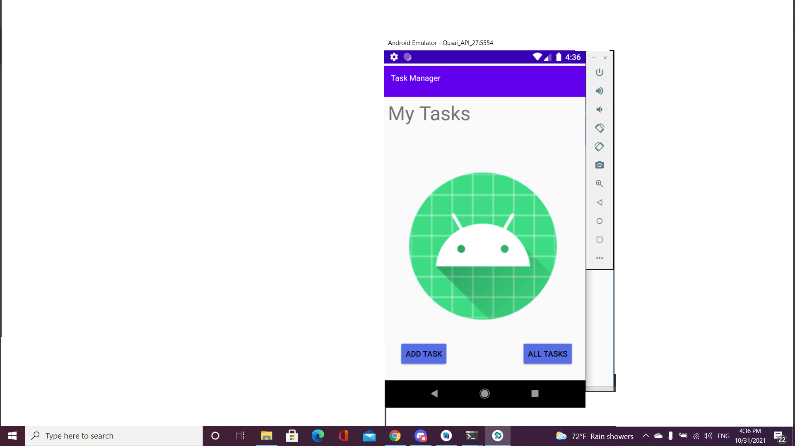

## description :

**this application consist of three Activities.**
  - Main Activity : Contain two buttons.. Add Task and All Tasks.
  - Add Task : Contain two input field and one button that calculate the number of your tasks.
  - All Tasks : Contain an image.

**Main Activity**

**Add Task**

**All Tasks**

