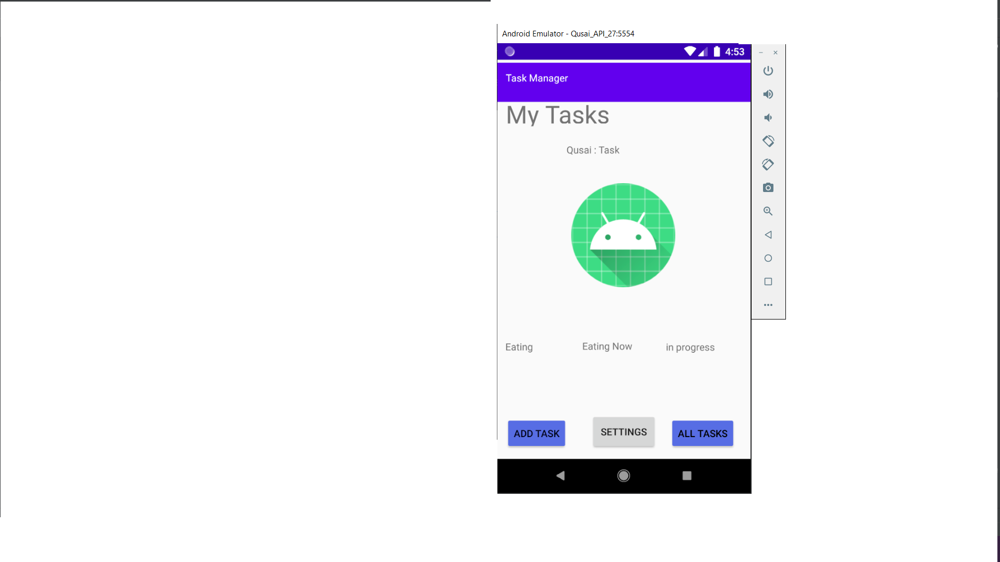
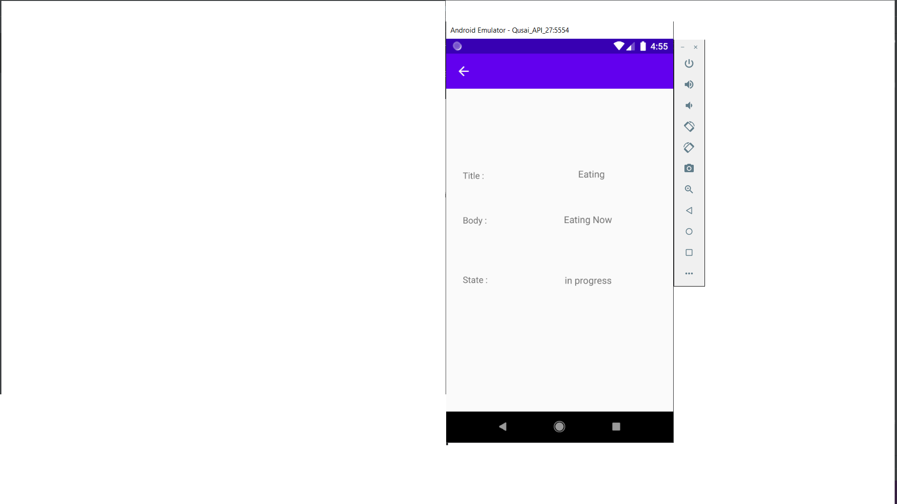

## description :

**this application consist of five Activities.**
  - Main Activity : Contain 3 buttons.. Add Task,All Tasks,Recycler view,Settings.
  - Add Task : Contain two input field and one button that calculate the number of your tasks.
  - All Tasks : Contain an image.
  - Task Details : Contain a 3 label for the title,body,state task and there bodies and there state.
  - Settings : Contain an input for the username and save button
    

  - Recycler view : move u to task details page and display the task

**Main Activity**

**Add Task Activity**

**All Tasks Activity**

**Task Details Activity**

**Settings Activity**

