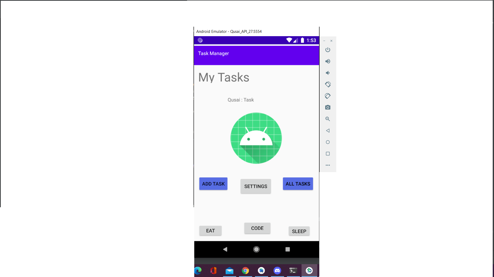
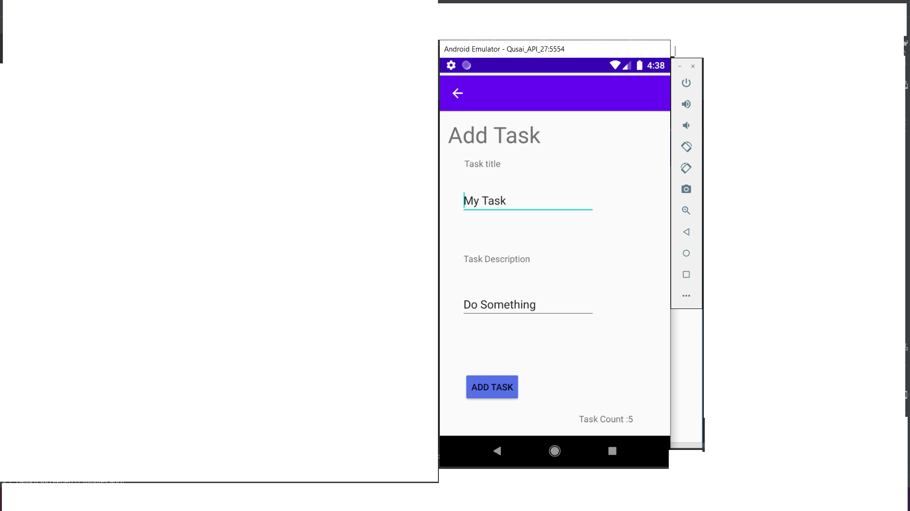
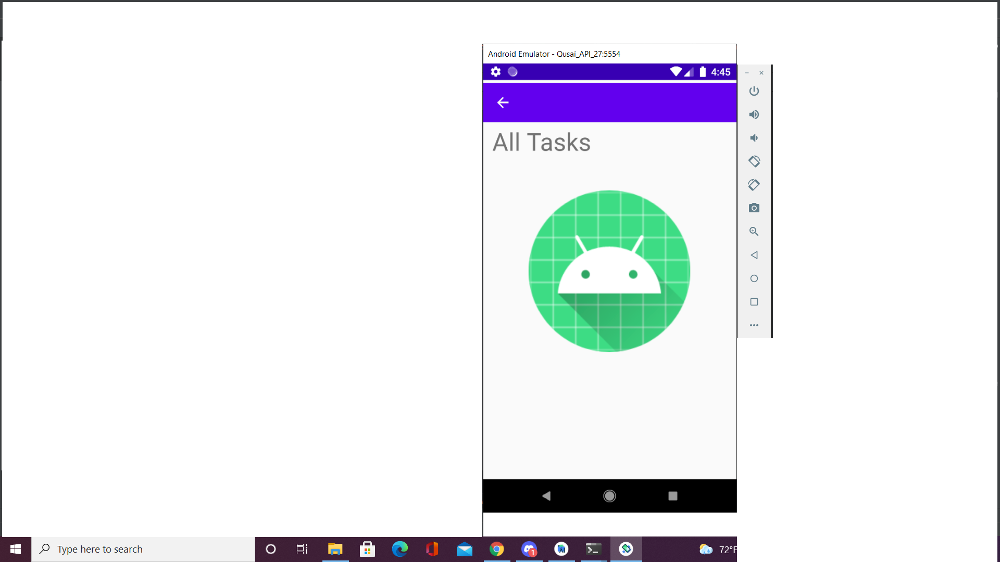
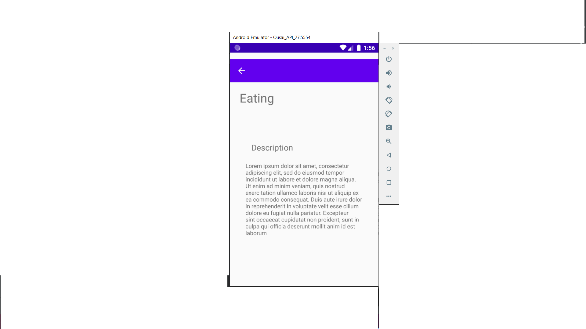
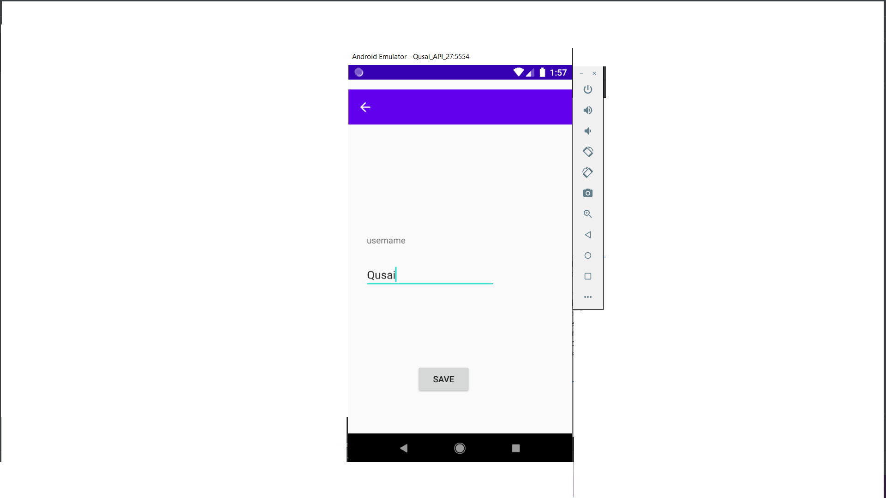

## description :

**this application consist of three Activities.**
  - Main Activity : Contain six buttons.. Add Task,All Tasks,Eat,Code,Sleep,Settings.
  - Add Task : Contain two input field and one button that calculate the number of your tasks.
  - All Tasks : Contain an image.
  - Task Details : Contain a label for the task and a description.
  - Settings : Contain an input for the username and save button
    

  - Eat,Code,Sleep buttons : move u to task details page and display the task

**Main Activity**

**Add Task Activity**

**All Tasks Activity**

**Task Details Activity**

**Settings Activity**

